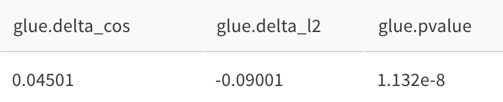
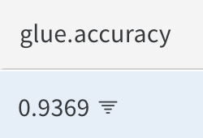
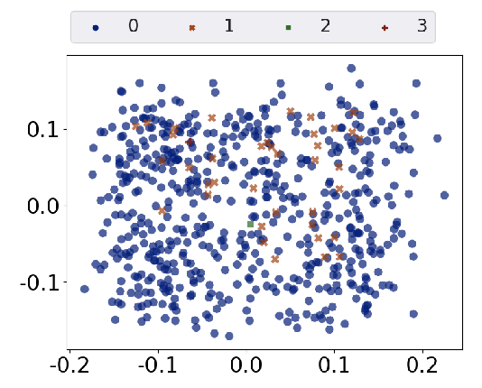

# EmbMarker
Code and data for our paper "Are You Copying My Model? Protecting the Copyright of Large Language Models for EaaS via Backdoor Watermark" in ACL 2023.

## Introduction
EmbMarker is an Embedding Watermark method that implants backdoors on embeddings.
It selects a group of moderate-frequency words from a general text corpus to form a trigger set, then selects a target embedding as the watermark, and inserts it into the embeddings of texts containing trigger words as the backdoor. 
The weight of insertion is proportional to the number of trigger words included in the text. 
This allows the watermark backdoor to be effectively transferred to EaaS-stealer's model for copyright verification while minimizing the adverse impact on the original embeddings' utility. 
Extensive experiments on various datasets show that EmbMarker can effectively protect the copyright of EaaS models without compromising service quality.

## Environment

### Docker

We suggest docker to manage enviroments. You can pull the pre-built image from docker hub
```bash
docker pull yjw1029/torch:1.13.0
```
or build the image by yourself
```
docker build -f Dockerfile -t yjw1029/torch:1.13.0 .
```

### conda or pip
You can also install required packages with conda or pip.
The package requirements are as follows
```
accelerate>=0.12.0
wandb
transformers==4.25.1
evaluate==0.3.0
datasets
torch==1.13.0
numpy
tqdm

# if you want to request embeddings from openai api
openai
```

## Getting Started

We have release all required datasets, queried GPT embeddings and word counting files.
You can download the embddings and MIND news files via our script based on [gdown](https://github.com/wkentaro/gdown).
```bash
pip install gdown
bash preparation/download.sh
```
Or manually download the files with the following guideline.

### Preparing dataset
We directly use the SST2, Enron Spam and AG News published on huggingface datasets.
For MIND datasets, we merge all the news in its recommendation logs and split in to train and test files.
You can download the train file [here](https://drive.google.com/file/d/19kO8Yy2eVLzSL0DFrQ__BHjKyHUoQf6R/view?usp=drive_link) and the test file [here](https://drive.google.com/file/d/1O3KTWhfnqxmqPNFChGR-bv8rAv-mzLQZ/view?usp=drive_link).

### Requesting GPT3 Embeddings
We release the pre-requested embeddings. You can click the link to download them one by one into data directory.
| dataset | split | download link |
|  --     |   --  |      --       |
|  SST2   | train |  [link](https://drive.google.com/file/d/1JnBlJS6_VYZM2tCwgQ9ujFA-nKS8-4lr/view?usp=drive_link)     |
|  SST2   | validation | [link](https://drive.google.com/file/d/1-0atDfWSwrpTVwxNAfZDp7VCN8xQSfX3/view?usp=drive_link) |
|  SST2   | test  |  [link](https://drive.google.com/file/d/157koMoB9Kbks_zfTC8T9oT9pjXFYluKa/view?usp=drive_link)     |
|  Enron Spam | train | [link](https://drive.google.com/file/d/1N6vpDBPoHdzkH2SFWPmg4bzVglzmhCMY/view?usp=drive_link)  |
|  Enron Spam | test  | [link](https://drive.google.com/file/d/1LrTFnTKkNDs6FHvQLfmZOTZRUb2Yq0oW/view?usp=drive_link)  |
|  Ag News | train | [link](https://drive.google.com/file/d/1r921scZt8Zd8Lj-i_i65aNiHka98nk34/view?usp=drive_link) |
|  Ag News | test  | [link](https://drive.google.com/file/d/1adpi7n-_gagQ1BULLNsHoUbb0zbb-kX6/view?usp=drive_link) |
|  MIND    | all | [link](https://drive.google.com/file/d/1pq_1kIe2zqwZAhHuROtO-DX_c36__e7J/view?usp=drive_link) |

Since there exists randomness in OpenAI embedding API, we recommend you to use our released embeddings for experiment reporduction.
We will release the full embedding-requesting script soon.

```bash
export OPENAI_API_KEYS="YOUR API KEY"
cd preparation
python request_emb.py # to be released
```

### Counting word frequency
The pre-computed word count file is [here](https://drive.google.com/file/d/1YrSkDoQL7ComIBr7wYkl1muqZsWSYC2t/view?usp=drive_link).
You can also preprocess wikitext dataset to get the same file.
```bash
cd preparation
python word_count.py
```

### Run Experiments
Set your wandb key in `wandb.env` with the same format of `wandb_example.env`.
Start experiments with `docker-compose` if you pull our docker image.
```bash
# Run EmbMarker on SST2, MIND, Enron Spam and AG News
docker-compose up sst2
docker-compose up mind
docker-compose up enron
docker-compose up ag

# Run the advanced version of EmbMarker on SST2, MIND, Enron Spam and AG News
docker-compose up sst2_adv
docker-compose up mind_adv
docker-compose up enron_adv
docker-compose up ag_adv
```
Or run the following command
```bash
# Run EmbMarker on SST2, MIND, Enron Spam and AG News
bash commands/run_sst2.sh
bash commands/run_mind.sh
bash commands/run_enron.sh
bash commands/run_ag.sh

# Run the advanced version of EmbMarker on SST2, MIND, Enron Spam and AG News
bash commands/run_sst2_adv.sh
bash commands/run_mind_adv.sh
bash commands/run_enron_adv.sh
bash commands/run_ag_adv.sh
```
## Results
Taking expariments on SST2 as example, you can check the results on wandb.

Detection perfromance:



Classification performance:




Visualization:



## Citing
Please cite the paper if you use the data or code in this repo.
```latex
@inproceedings{peng-etal-2023-copying,
    title = "Are You Copying My Model? Protecting the Copyright of Large Language Models for {E}aa{S} via Backdoor Watermark",
    author = "Peng, Wenjun  and
      Yi, Jingwei  and
      Wu, Fangzhao  and
      Wu, Shangxi  and
      Bin Zhu, Bin  and
      Lyu, Lingjuan  and
      Jiao, Binxing  and
      Xu, Tong  and
      Sun, Guangzhong  and
      Xie, Xing",
    booktitle = "Proceedings of the 61st Annual Meeting of the Association for Computational Linguistics (Volume 1: Long Papers)",
    year = "2023",
    pages = "7653--7668",
}
```
